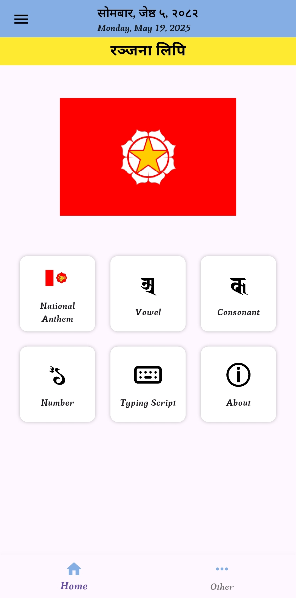
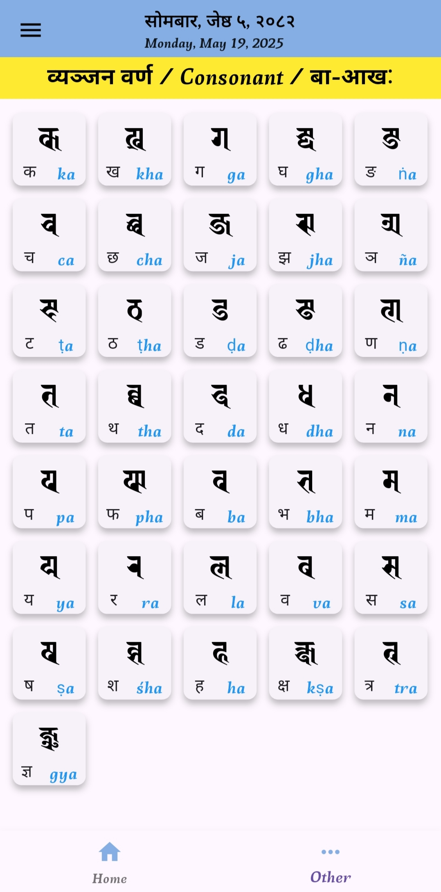
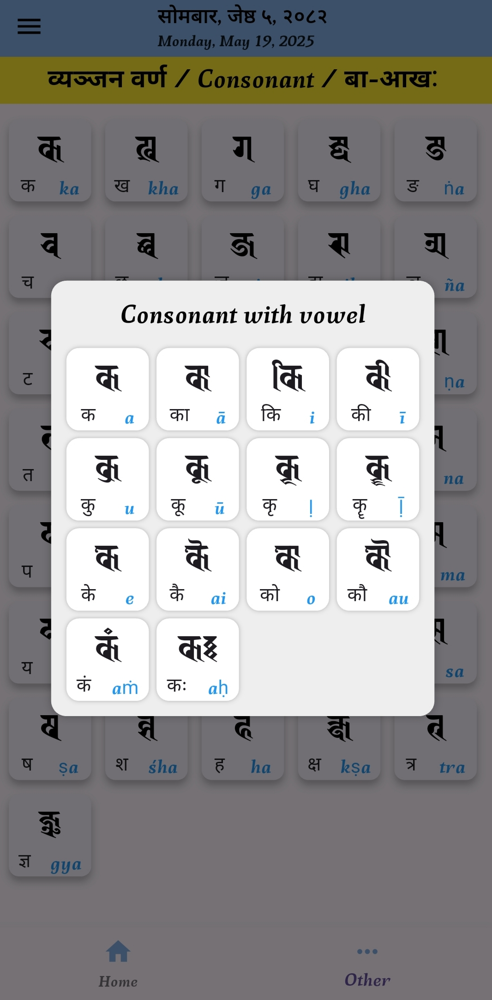
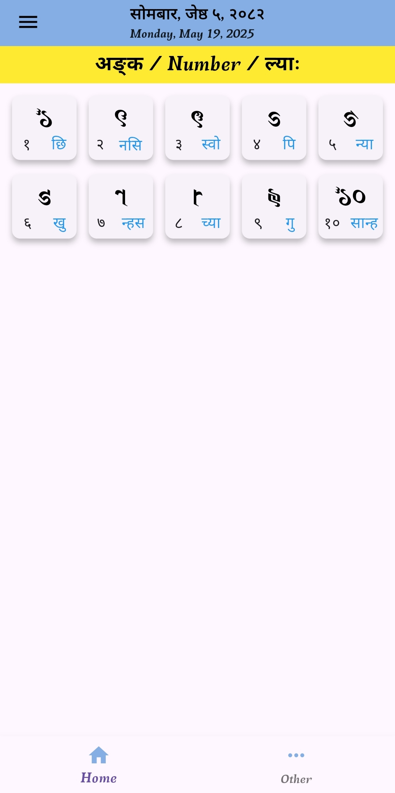
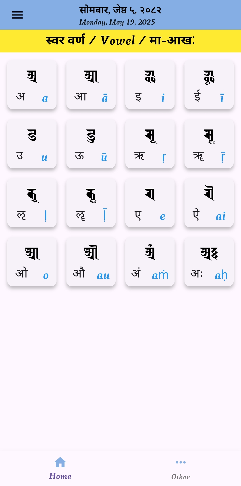
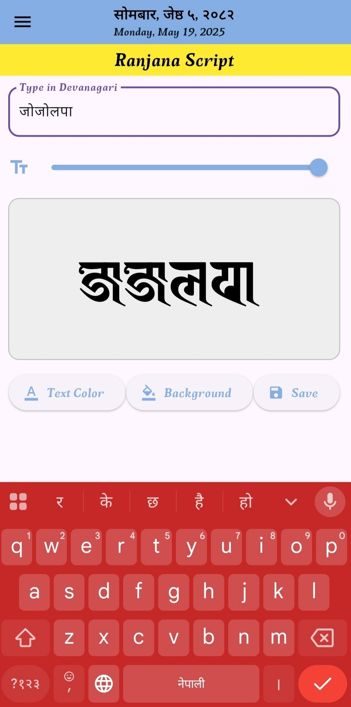
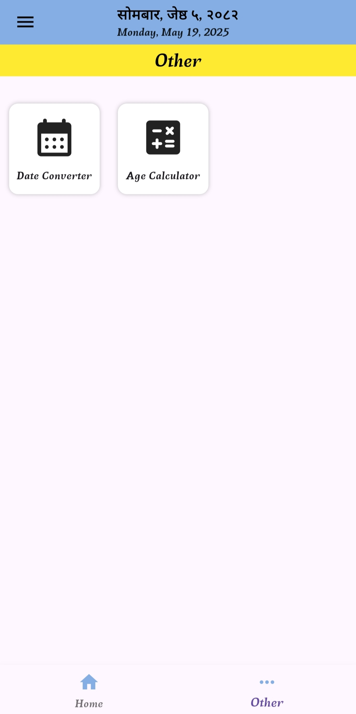
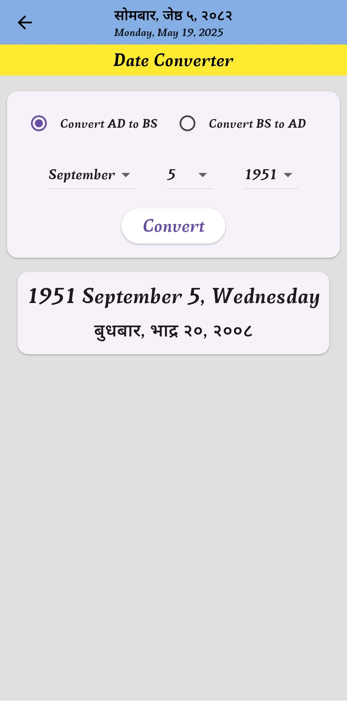
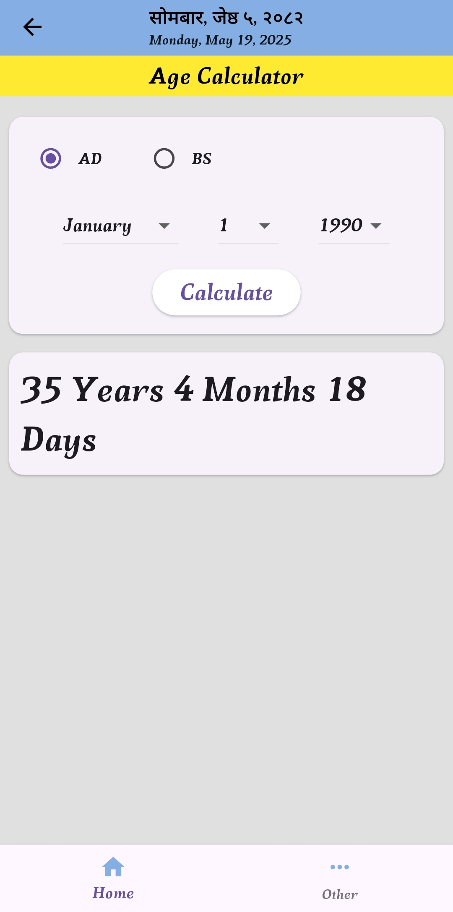

# Ranjana Lipi

The Ranjana Script (Lantsa) is an abugida writing system which developed in the 11th century and until the mid-20th century was used in an area from Nepal to Tibet by the Newar people, the historic inhabitants of the Kathmandu Valley, to write Sanskrit and Newar (Nepal Bhasa). 

Ranjana is a Brahmic script which developed around 1100 CE. It was used in Nepal and is still used in Nepal by the Newar people to write the Newar language. The script is also used in most of the Mahayana and Vajrayana monasteries. 

## Screen shorts
<table>
<td></td>
<td></td>
<td></td>
</table>
<table>
<td></td>
<td></td>
<td></td>
</table>

<table>
<td></td>
<td></td>
<td></td>
</table>

## Getting Started

This project is a starting point for a Flutter application.

A few resources to get you started if this is your first Flutter project:

- [Lab: Write your first Flutter app](https://docs.flutter.dev/get-started/codelab)
- [Cookbook: Useful Flutter samples](https://docs.flutter.dev/cookbook)

For help getting started with Flutter development, view the
[online documentation](https://docs.flutter.dev/), which offers tutorials,
samples, guidance on mobile development, and a full API reference.
